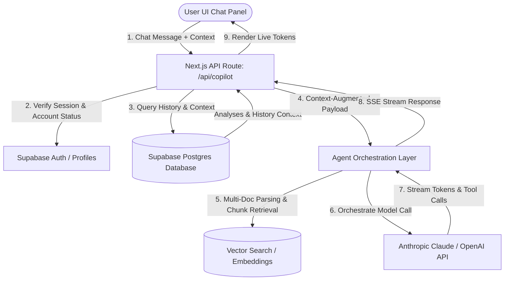

# Narratix Copilot — Future Agentic AI Architecture

This document defines the architectural blueprints, schema design, context orchestration, and processing pipelines for the upcoming **Narratix Copilot**—a real-time, context-aware AI agent designed to help creators design, optimize, and audit high-retention short-form scripts.

---

## 1. System Topology & Flow



---

## 2. Core Capabilities Spec

### 2.1. Analysis Q&A & Report Explanation
- **Objective**: Explain the underlying reasoning behind any score in the generated diagnostic report.
- **Implementation**: The chat companion retains a reference to the active `analysis_id`. When queried (e.g., *"Why did my hook get a 6.2?"*), the Copilot parses the diagnostic JSON payload for the hook module (including `speed`, `intrigue`, `clarity`, and `resonance` fields) and delivers structured, human-like explanations.

### 2.2. Hook Generation
- **Objective**: Generate multiple high-retention scroll-stopping hook variants matching the platform niche.
- **Implementation**: Expose a tool call to the LLM agent (`generate_hooks`).
- **Prompt Architecture**: Uses frameworks like *AIDA*, *Open Loop*, *Negative Frame*, and *Contrarian Statement* tailored to short-form algorithms.

### 2.3. Script Rewriting
- **Objective**: Optimize sentences, word pacing, and B-roll alignment of user scripts.
- **Implementation**: Structured rewrite modes:
  - **Tighten Pacing**: Rephrases slow sentences, trims filler words, and highlights where visual cues should be inserted.
  - **Improve Transition Flow**: Ensures the body flows naturally into the Call To Action (CTA).

### 2.4. Content Strategy & Viral Optimization
- **Objective**: Provide structured formatting, hook combinations, caption styling, and hashtag configuration.
- **Implementation**: The model cross-references viral pattern trends for specific niches (e.g., tech vs. fitness) and injects dynamic script configurations like visual B-roll loops or secondary overlay advice.

### 2.5. Niche-Specific Recommendations
- **Objective**: Dynamic prompt tailoring according to creator niche and platform target.
- **Implementation**: Auto-adjusts vocabulary and metrics based on the target platform (e.g., YouTube Shorts pacing versus LinkedIn script depth).

### 2.6. Multi-Document Context (PDF, DOCX, TXT Chat)
- **Objective**: Allow creators to upload research papers, transcripts, or notes as direct background context.
- **Implementation**:
  - **Short Files (< 100k tokens)**: Injected directly into the system prompt window.
  - **Long Files / Multi-Docs**: Split text into paragraphs, compute vector embeddings via `text-embedding-3-small`, store in Supabase via `pgvector`, and run Cosine Similarity matches during chat interactions to pull semantic context chunks.

### 2.7. Analysis History Context
- **Objective**: Deliver holistic insights across the creator's last 5-10 uploads.
- **Implementation**: Pre-loads metadata summaries of the user's historic reports (date, platform, average hook score, pacing score) to track creator improvement and give advice like: *"Your hook scores are improving, but your pacing score has dropped in your last two scripts."*

---

## 3. Recommended Postgres Schema Additions

To support session history and thread tracking, the database schema should be extended with the following tables:

```sql
-- 1. Create Copilot Chat Session Table
CREATE TABLE public.copilot_sessions (
    id UUID PRIMARY KEY DEFAULT gen_random_uuid(),
    user_id UUID NOT NULL REFERENCES auth.users(id) ON DELETE CASCADE,
    title TEXT NOT NULL DEFAULT 'New Conversation',
    pinned_analysis_id UUID REFERENCES public.analyses(id) ON DELETE SET NULL,
    created_at TIMESTAMP WITH TIME ZONE DEFAULT timezone('utc'::text, now()) NOT NULL,
    updated_at TIMESTAMP WITH TIME ZONE DEFAULT timezone('utc'::text, now()) NOT NULL
);

-- 2. Create Copilot Messages Table
CREATE TABLE public.copilot_messages (
    id UUID PRIMARY KEY DEFAULT gen_random_uuid(),
    session_id UUID NOT NULL REFERENCES public.copilot_sessions(id) ON DELETE CASCADE,
    role TEXT NOT NULL CHECK (role IN ('user', 'assistant', 'system')),
    content TEXT NOT NULL,
    metadata JSONB DEFAULT '{}'::jsonb,
    created_at TIMESTAMP WITH TIME ZONE DEFAULT timezone('utc'::text, now()) NOT NULL
);

-- 3. Enable RLS Policies
ALTER TABLE public.copilot_sessions ENABLE ROW LEVEL SECURITY;
ALTER TABLE public.copilot_messages ENABLE ROW LEVEL SECURITY;

-- 4. Session Access Policies
CREATE POLICY "Users can manage their own copilot sessions"
    ON public.copilot_sessions
    FOR ALL
    TO authenticated
    USING (auth.uid() = user_id)
    WITH CHECK (auth.uid() = user_id);

-- 5. Message Access Policies
CREATE POLICY "Users can access messages in their sessions"
    ON public.copilot_messages
    FOR ALL
    TO authenticated
    USING (
        EXISTS (
            SELECT 1 FROM public.copilot_sessions
            WHERE public.copilot_sessions.id = session_id 
            AND public.copilot_sessions.user_id = auth.uid()
        )
    );
```

---

## 4. Prompt Engineering & Context Augmentation Specification

The system prompt for Narratix Copilot should follow a highly structured system role definition:

```yaml
system_role: |
  You are Narratix Copilot, an elite diagnostic script consultant and viral optimization expert for short-form content.
  Your objective is to help the creator achieve retention rates exceeding 70% on short-form platforms (TikTok, Reels, Shorts).

  Contextual Knowledge Available:
  - Active Analysis Report: {{active_analysis_json}}
  - Past Performance History: {{history_metadata_json}}
  - Semantic Document Chunks: {{retrieved_document_chunks}}

  Core Diagnostic Directives:
  1. Ground all feedback in real diagnostics. If the user asks about their score, reference the specific module parameters.
  2. Write hooks with maximum cognitive speed and zero introduction fluff (never start with "In this video, I will...").
  3. Tailor pacing advice explicitly to the platform (e.g., TikTok requires rapid cut guides; LinkedIn requires text-heavy visual framing).
```

---

## 5. UI Integration Specification

- **Trigger Button**: Retain the floating circular bubble (`#ai-agent-btn`) with subtle micro-animations.
- **Workspace Panel Layout**: Slide-out tray or sidebar panel containing:
  1. **Header**: Connection state, Copilot active toggle, and Pinned Report reference badge.
  2. **Waitlist / Pre-Preview Block**: Elegant early-access pill indicator.
  3. **Message Feed**: Real-time Server-Sent Events (SSE) stream text bubble renderer with syntax highlighted markdown code blocks and diff previews.
  4. **Quick CTAs**: Fast prompt injection buttons (e.g., *"Rewrite Hook"*, *"Explain pacing suggestions"*, *"Optimize B-roll"*).
