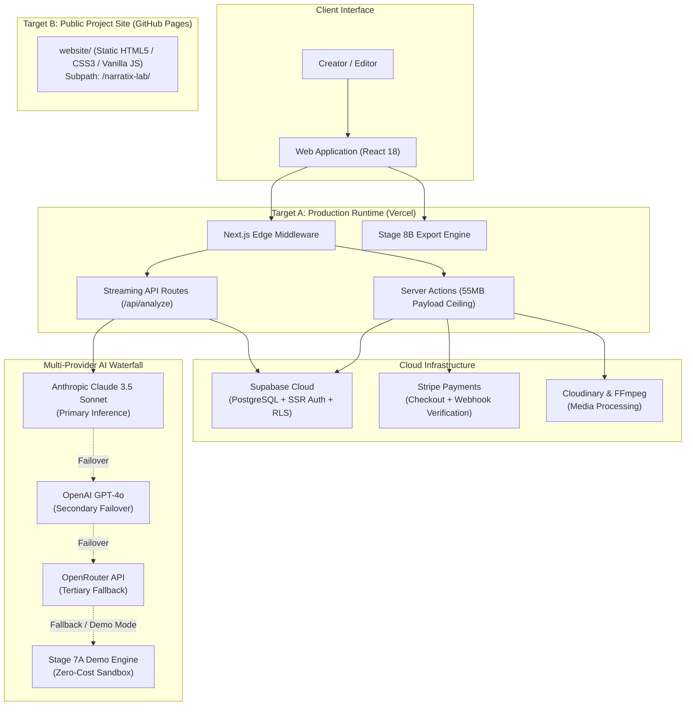

<div align="center">

# Narratix Lab

### Creator Intelligence for Better Content Decisions

Analyze content performance, understand audience behavior, and turn content data into actionable creative insights.

[](https://github.com/imsubhs/narratix-lab/actions/workflows/ci.yml)
[](https://github.com/imsubhs/narratix-lab/actions/workflows/pages.yml)
[](https://nextjs.org/)
[](https://www.typescriptlang.org/)
[](https://narratix-lab.vercel.app/)
[](#license)

[**Launch Production Web App**](https://narratix-lab.vercel.app/) • [**Public Project Site (GitHub Pages)**](https://imsubhs.github.io/narratix-lab/) • [**Architecture Guide**](docs/deployment/GITHUB_PAGES_ARCHITECTURE.md) • [**Security Policy**](SECURITY.md)

</div>

---

## 1. What is Narratix Lab?

**Narratix Lab** is an engineering-grade Creator Intelligence Platform engineered for long-form and short-form video creators, editors, and production teams. 

Rather than relying on generic LLM feedback or trial-and-error publishing, Narratix Lab extracts narrative structure, calculates cognitive pacing, scores hook strength, and pinpoints viewer retention drop-off hazards before camera recording or post-production editing begins.

---

## 2. Why It Exists

Video storytelling is often treated as purely subjective, leading to volatile audience retention:
- **Hook Ambiguity**: Creators publish without knowing if their first 15 seconds will capture viewer attention.
- **Exposition Drag**: Unnecessary exposition or narrative lulls cause audience attrition that analytics tools only reveal weeks after publishing.
- **Format Inflexibility**: Editors, scriptwriters, and directors need structured outputs (PDFs, Word docs, Markdown, HTML) rather than chat-bubble replies.

Narratix Lab bridges this gap by treating scripts as quantifiable blueprints, providing deterministic rubric scores and multi-format reports through a resilient multi-provider AI waterfall.

---

## 3. Core Capabilities

| Capability | Scope | Description |
| :--- | :--- | :--- |
| **Creator Intelligence** | **Available Now** | Structural script evaluation, narrative arc mapping, and hook urgency scoring (0–100 scale). |
| **Retention Hazard Detection** | **Available Now** | Pacing analysis, exposition fatigue alerts, and Flesch-Kincaid cognitive readability metrics. |
| **Professional Multi-Format Export** | **Available Now** | Stage 8B engine compiles canonical report models into **6 verified formats** (PDF, Word, Markdown, HTML, Plain Text, RTF). |
| **Multi-Provider AI Waterfall** | **Available Now** | Resilient inference waterfall: Claude 3.5 Sonnet leads, OpenAI GPT-4o provides failover, OpenRouter serves as tertiary fallback. |
| **Zero-Cost Demo Engine** | **Available Now** | Stage 7A deterministic engine with 10 schema-valid curated benchmark profiles for zero-token testing. |
| **Modern Dark Design System** | **Available Now** | Phase 0.5B operational UI with Deep Space canvas (`#0B0B0C`), Electric Violet accents (`#7C3AED`), and MCP settings surface. |
| **YouTube Retention Intelligence** | **Planned (Beta V2)** | Direct YouTube OAuth 2.0 channel ingestion correlating second-by-second watch curves with script timecodes. |
| **Contextual Script Copilot** | **Planned (Beta V2)** | Interactive line-by-line rewrite assistant guided by empirical audience retention data. |

---

## 4. Product Surfaces

The application organizes creator workflows into focused operational surfaces:

* **`/dashboard`**: Project overview, recent analyses list, media upload panels, and quota usage.
* **`/analyze`**: Interactive script ingestion workbench with real-time word counting, niche selection, and live streaming SSE analysis.
* **`/reports/[id]`**: Full multi-tab analytical report viewer featuring executive summaries, module rubrics, and action plans.
* **`/settings`**: Account preferences, billing tier configuration, password management, and Model Context Protocol (MCP) surface (`?tab=mcp`).
* **`/history`**: Historical analysis archive with searchable script records and quick export triggers.

---

## 5. System Architecture

Narratix Lab enforces a strict **dual-target deployment architecture**:
1. **Production SaaS (`narratix-lab.vercel.app`)**: Runs on Vercel with full Next.js App Router server runtime, Supabase SSR, Stripe billing, and AI waterfall.
2. **Public Project Portal (`imsubhs.github.io/narratix-lab`)**: Runs on GitHub Pages as a zero-dependency static documentation site with zero secrets.



---

## 6. Technology Stack

Verified directly against `package.json`:

| Layer | Technologies | Purpose |
| :--- | :--- | :--- |
| **Core Framework** | Next.js 14.2.15, React 18.3.1 | App Router, Server Actions, Edge Middleware |
| **Language** | TypeScript 5.9.3 | Strict Mode compilation, strict schema contracts |
| **Styling & UI** | Tailwind CSS 3.4.17, CSS Variables | Curated `--nl-*` tokens, Modern Dark palette |
| **Authentication & DB** | `@supabase/ssr` 0.5.2, `@supabase/supabase-js` 2.49.0 | Cookie-based sessions, PostgreSQL with RLS |
| **AI Inference** | `@anthropic-ai/sdk` 0.110.0, `openai` 4.57.0 | Streaming multi-provider AI waterfall |
| **Payments** | `stripe` 17.5.0 | Subscription billing and webhook listener |
| **Document Generation** | `jspdf` 4.2.1, `docx` 9.7.1 | Vector PDF layout and native Word document export |
| **Media Processing** | `fluent-ffmpeg` 2.1.3, `cloudinary` 2.9.0 | Media transcript extraction and secure storage |
| **Testing & Tooling** | `tsx` 4.23.0, `playwright` 1.61.0 | Offline regression suites and E2E browser harness |

---

## 7. Repository Structure

```
narratix-lab/
├── .github/
│   ├── ISSUE_TEMPLATE/               # Bug report and feature request templates
│   ├── workflows/
│   │   ├── ci.yml                    # Automated build, lint, typecheck & offline tests
│   │   └── pages.yml                 # GitHub Pages deployment pipeline (website/)
│   └── pull_request_template.md      # Pull request quality gate
├── app/                              # Next.js 14 App Router application
│   ├── (auth)/                       # Liquid-glass login and signup views
│   ├── (main)/                       # Marketing and legal views (about, contact, terms)
│   ├── analyze/                      # Script analyzer workbench UI
│   ├── api/                          # Server routes (SSE analyze, stripe, auth, health)
│   ├── dashboard/                    # Core project dashboard
│   ├── reports/[id]/                 # Canonical report rendering view
│   ├── settings/                     # User preferences and MCP integration surface
│   └── globals.css                   # Modern Dark tokens and global styles
├── components/                       # Modular React 18 components
│   ├── analyzer/                     # Real-time analysis client components
│   ├── auth/                         # Authentication cards and provider
│   ├── dashboard/                    # Upload panels and result cards
│   ├── layout/                       # Collapsible AppShell and navigation rail
│   └── settings/                     # Tactile toggles and MCP surface tabs
├── lib/                              # Core business logic and infrastructure
│   ├── ai/                           # Multi-provider waterfall and Stage 7A demo profiles
│   ├── export/                       # Stage 8B 6-format document export system
│   └── supabase/                     # SSR, browser, and admin database clients
├── public/                           # Static assets for the Next.js SaaS app
│   └── brand/                        # High-resolution marks and normalized icons
├── scripts/                          # Offline test suites and engineering scripts
│   ├── demo-tests.ts                 # Stage 7A offline regression test suite (43 checks)
│   └── export-tests.ts               # Stage 8B offline export test suite (67 checks)
├── website/                          # Target B: Public Static Site for GitHub Pages
│   ├── assets/                       # Subpath-safe localized brand assets
│   ├── css/style.css                 # Standalone Modern Dark stylesheet
│   ├── js/main.js                    # Vanilla JS accessible drawer and interactions
│   └── index.html                    # Public showcase, architecture and docs portal
├── docs/                             # Permanent technical documentation
│   ├── deployment/                   # GITHUB_PAGES_ARCHITECTURE.md
│   ├── REPOSITORY_ARCHITECTURE.md    # In-depth architectural specification
│   └── REPOSITORY_UPGRADE_REPORT.md  # Upgrade log and forensic audit report
├── CONTRIBUTING.md                   # Engineering standards and contribution guidelines
├── SECURITY.md                       # Security policy and secret protection rules
└── README.md                         # Authoritative project landing page
```

---

## 8. Current Status

| Area | Status | Verified Evidence |
| :--- | :---: | :--- |
| **Core Next.js SaaS** | **Active** | Compiles 23 routes cleanly via `npm run build` |
| **Modern Dark Visual System** | **Stabilized** | `--nl-*` token palette, WCAG-contrast verified |
| **Public Project Site** | **Active / Ready** | Zero-dependency static site in `website/` ready for Pages |
| **Creator Intelligence** | **Active** | Hook scoring and pacing diagnostics implemented |
| **Multi-Format Export Suite** | **Active** | 6 formats verified via 67 automated checks |
| **Zero-Cost Demo Engine** | **Active** | 10 profiles verified via 43 automated checks |
| **GitHub Actions Automation** | **Configured** | Independent `ci.yml` and `pages.yml` workflows |
| **YouTube Retention Intelligence** | **Planned** | Data contracts and schema scheduled for Phase 0.8+ |
| **Interactive Contextual Copilot** | **Planned** | Iterative script rewriting scheduled for Beta V2 |

---

## 9. Public Project Site (GitHub Pages)

The public site is isolated inside `website/` and published to:  
**[https://imsubhs.github.io/narratix-lab/](https://imsubhs.github.io/narratix-lab/)**

* **Architecture**: 100% static HTML5, CSS3, and vanilla JS.
* **Separation**: The public site never touches Node.js, Supabase, Stripe, or server secrets.
* **Base Path Safety**: All internal references use `./` relative paths, preventing `404 Not Found` errors under `/narratix-lab/`.

---

## 10. Local Development

### Prerequisites
- Node.js `20.x` or higher
- npm `10.x` or higher

### Getting Started

```bash
# 1. Clone repository
git clone https://github.com/imsubhs/narratix-lab.git
cd narratix-lab

# 2. Install exact locked dependencies
npm ci

# 3. Configure local environment variables
cp .env.example .env.local

# 4. Start local development server
npm run dev
```

Open [http://localhost:3000](http://localhost:3000) to view the application.

---

## 11. Environment Configuration

Expected environment variable keys (documented in `.env.example`). **Never commit actual secret values**:

```env
# Supabase (Auth & PostgreSQL)
NEXT_PUBLIC_SUPABASE_URL
NEXT_PUBLIC_SUPABASE_ANON_KEY
SUPABASE_SERVICE_ROLE_KEY

# AI Providers (Waterfall)
ANTHROPIC_API_KEY
OPENAI_API_KEY
OPENROUTER_API_KEY
DEMO_MODE=true

# Stripe (Billing & Webhooks)
STRIPE_SECRET_KEY
STRIPE_WEBHOOK_SECRET
NEXT_PUBLIC_STRIPE_PUBLISHABLE_KEY
STRIPE_PRO_PRICE_ID
STRIPE_TEAM_PRICE_ID

# Media & Application
CLOUDINARY_CLOUD_NAME
CLOUDINARY_API_KEY
CLOUDINARY_API_SECRET
NEXT_PUBLIC_APP_URL
ALLOWED_HOSTS
```

---

## 12. Testing & Quality Assurance

Narratix Lab includes self-contained offline regression test suites that run without network access or live database credentials:

```bash
# 1. TypeScript Strict Typecheck
npx tsc --noEmit

# 2. Next.js ESLint Rule Validation
npm run lint

# 3. Stage 7A Offline Demo Mode Regression Tests (43 checks)
npm run test:demo

# 4. Stage 8B Offline Professional Export System Tests (67 checks)
npm run test:export

# 5. Full Production Next.js Build
npm run build
```

---

## 13. Deployment

* **Production Application $\rightarrow$ Vercel**:
  - Automatically triggered upon merge to `main`.
  - Deploys full dynamic Next.js App Router with server actions and streaming endpoints.
* **Public Project Site $\rightarrow$ GitHub Pages**:
  - Driven by `.github/workflows/pages.yml`.
  - Deploys exclusively the `website/` directory.
  - Requires **Source: GitHub Actions** in repository Settings $\rightarrow$ Pages.

---

## 14. Roadmap

### Completed
- [x] Beta V1 Core SaaS Architecture on Vercel
- [x] Stage 7A Curated Demo Profile Engine (10 profiles, zero API cost)
- [x] Stage 8B Professional Export Suite (PDF, Word, Markdown, HTML, TXT, RTF)
- [x] Phase 0.5B Modern Dark UI Integration (Liquid-Glass Auth, MCP Settings)

### Current Phase (Phase 0.7)
- [x] GitHub identity migration from `riansaha321` to `imsubhs`
- [x] Repository boundary enforcement and parent-directory protection
- [x] Public static showcase portal (`website/`)
- [x] GitHub Pages automated deployment pipeline (`pages.yml`)
- [x] GitHub Actions production validation suite (`ci.yml`)
- [x] Comprehensive architecture and deployment documentation suite

### Planned (Phase 0.8 & Beta V2)
- [ ] Database schema expansion for channel-level retention profiles
- [ ] YouTube Data API and Analytics API data contract formalization
- [ ] Direct YouTube OAuth 2.0 integration & channel analytics ingestion
- [ ] Temporal curve alignment engine (second-by-second drop-off mapping)
- [ ] Contextual AI Script Copilot for timeline-driven script restructuring

---

## 15. Security

Narratix Lab enforces a zero-secrets policy in repository source code. All server-side API keys reside exclusively in secure runtime environment variables. See [SECURITY.md](SECURITY.md) for vulnerability disclosure guidelines.

---

## 16. Contributing

Please review [CONTRIBUTING.md](CONTRIBUTING.md) for coding conventions, branching guidelines (`feat/...`), and PR verification requirements before opening a pull request.

---

## 17. License

Proprietary. All rights reserved &copy; 2026 Narratix Labs.  
*(Marked `"private": true` in `package.json`)*.

---

## 18. Author & Project

* **Repository Owner**: Subham Saha ([@imsubhs](https://github.com/imsubhs))
* **Authoritative Repository**: [https://github.com/imsubhs/narratix-lab](https://github.com/imsubhs/narratix-lab)
* **Production Deployment**: [https://narratix-lab.vercel.app/](https://narratix-lab.vercel.app/)
* **Public Project Portal**: [https://imsubhs.github.io/narratix-lab/](https://imsubhs.github.io/narratix-lab/)
